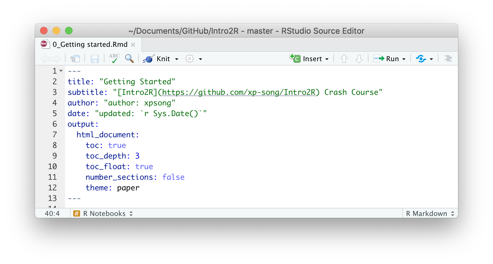
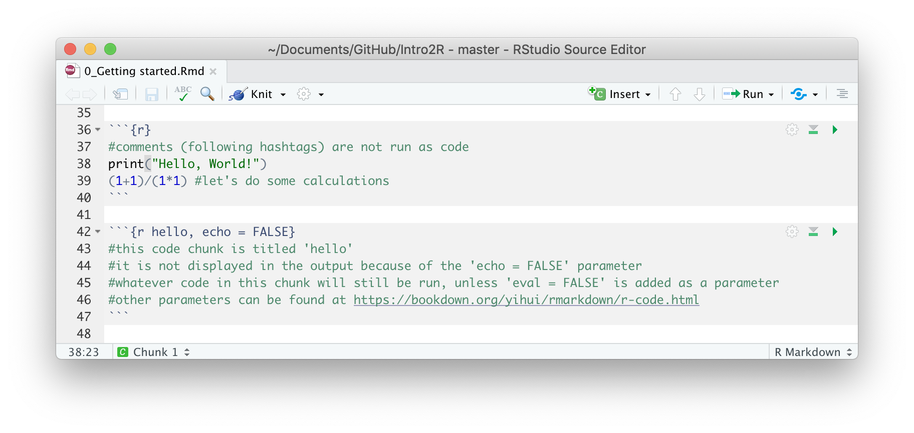
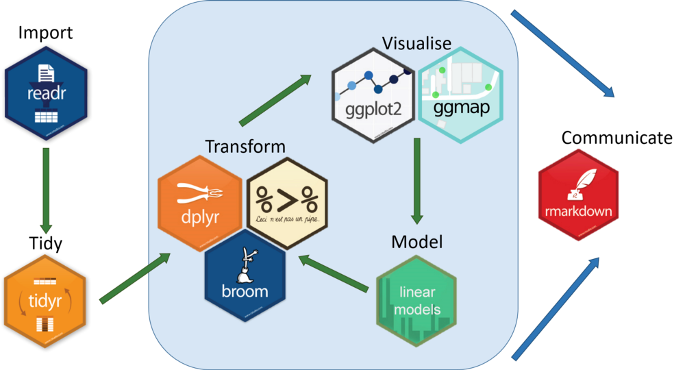
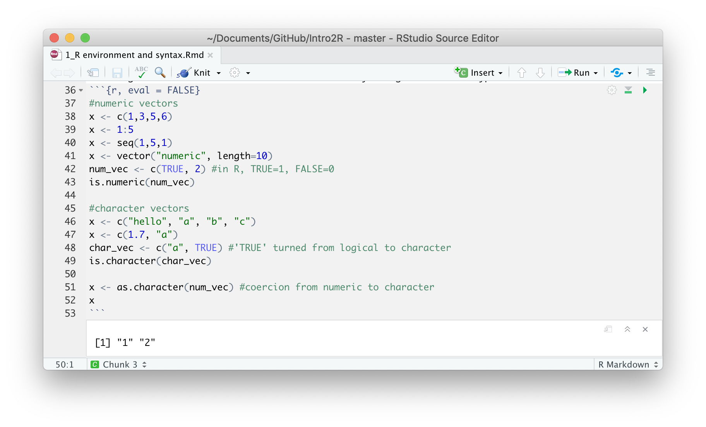
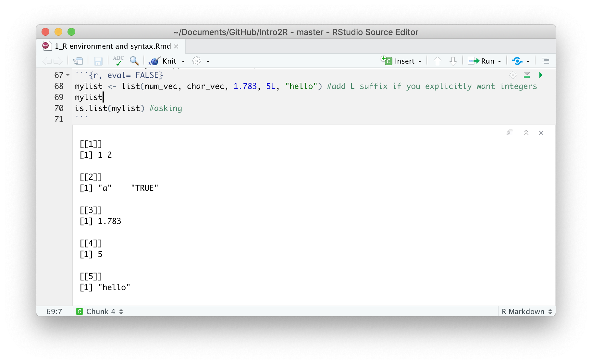
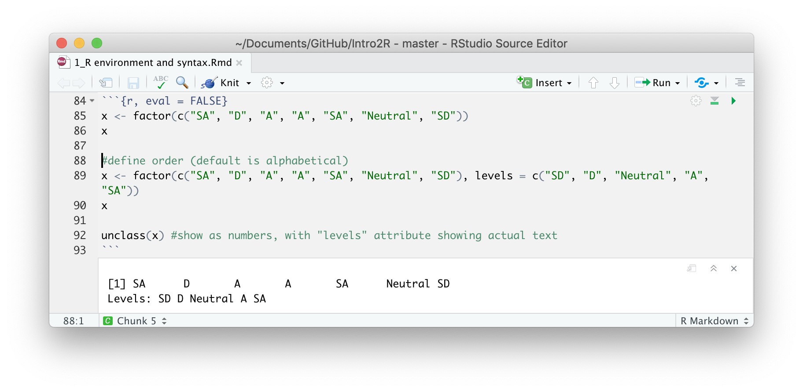
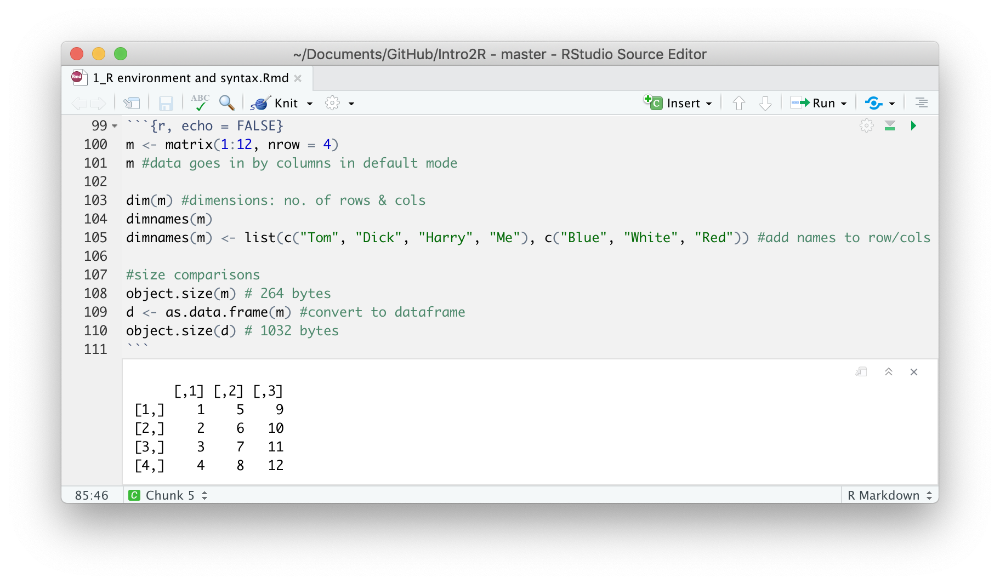
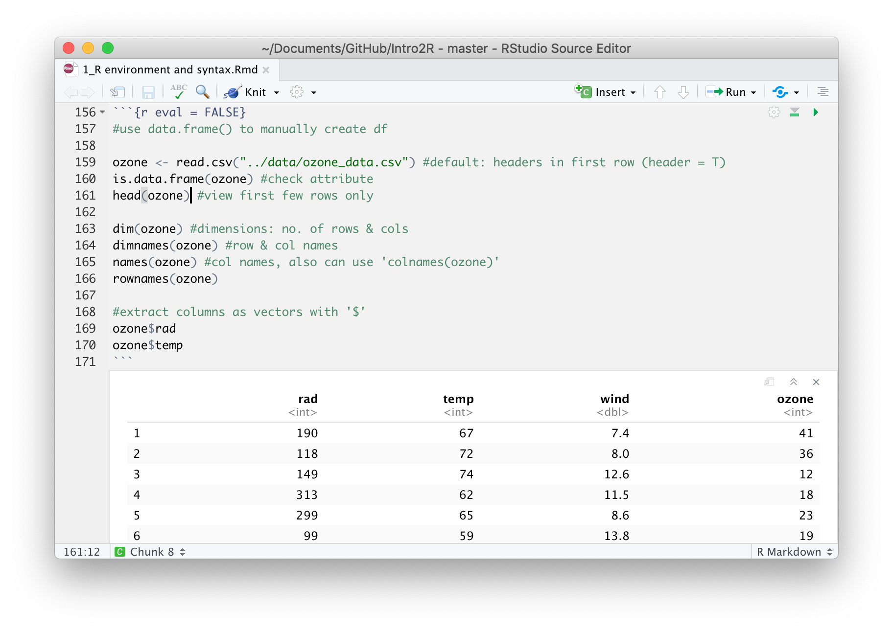
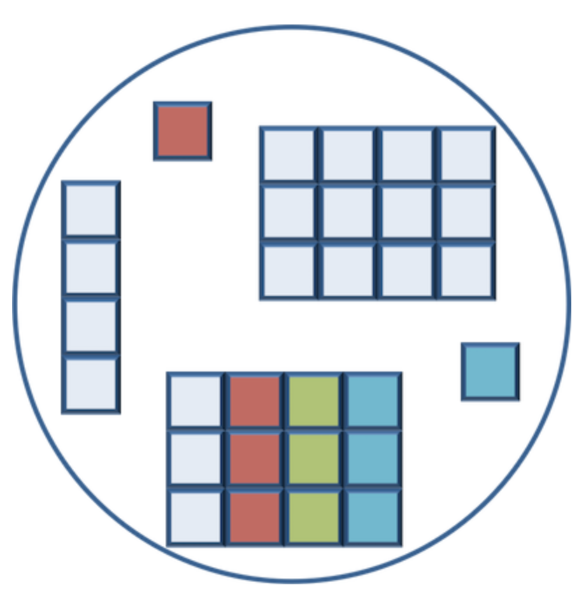

```{r setup, eval = FALSE, include = FALSE}
#Slides
#https://bookdown.org/yihui/rmarkdown/xaringan.html
install.packages("xaringan")
```

```{r xaringan themer, eval = FALSE, include = FALSE}
#if you want custom css theme
# install.packages("devtools")
devtools::install_github("gadenbuie/xaringanthemer")

options(htmltools.dir.version = FALSE)
library(xaringan)
library(xaringanthemer)

mono_light(
  base_color = "#1c5253",
  header_font_google = google_font("Josefin Sans"),
  text_font_google   = google_font("Montserrat", "300", "300i"),
  code_font_google   = google_font("Droid Mono")
)
```

class: inverse, center, middle

# Outline  

__[About this crash course](#4)__  
 
__[Getting Started](#Getstarted)__  

__[R Environment and Syntax](#Renviron)__  

Syntax: [Operators](#operators)

Syntax: [Subsetting](#subsetting)

Objects in R: [Variables](#variables)

Objects in R: [Data structures](#struc)

Objects in R: [Functions](#functions)

__[Useful Resources](#resources)__  

---

background-image: url(https://www.r-project.org/logo/Rlogo.svg)
background-size: 100px
background-position: 95% 5%
class: left

# What is R?

- Programming language and software environment
- Started in the 1990s mainly for statistical analysis
- Command line interface
- RStudio is commonly used as a graphical user interface
- Both R and RStudio are open source software
- Many resources and help available online from large community of developers/users
- Huge (and growing) library of user-created _packages_ offer many functions beyond statistics (even to translate R to other languages!)


???

- Cmd line: unlike GUI-based software such as Excel, SPSS, etc.
- Rstudio: Just like how Microsoft Word provides many more functions than a basic text editor, RStudio provides many functions for coding.
- Huge library: make beautiful graphics, build websites, etc.

---
class: left

# About this crash course

## What it IS
- Designed for those with minimal coding experience
- Dive right into organising, visualising and analysing data
- Give you a taste of the power of R and its potential applications
- Help you kick-start your journey to becoming more data-savvy 🤓 

--

## What it is NOT
- A substitute to learning the fundamentals of the language
- A lesson in statistics

---

class: left

# About this crash course

```{r eval = TRUE, echo = FALSE, out.height=70}
knitr::include_graphics("https://www.rstudio.com/wp-content/uploads/2018/10/RStudio-Logo-flat.svg")
```
  
We will work entirely with RStudio, and run our scripts in R Notebooks (*.Rmd* files)<sup>1</sup>, instead of basic R scripts (*.R* files).

<br>
  
**What are R Notebooks?**
- They are [R Markdown](http://rmarkdown.rstudio.com) documents that allow us to intersperse regular text with chunks of code
- They allow us to interact with our code and view outputs within a single document
- They can be '_knit_' into different file-types (i.e. Word, Slides, PDF, HTML, etc.)


.footnote[
[1] All materials in this course were created from _.Rmd_ files. We will work within these source files available in the _/notes_ folder. The course slides and their source files are located at _/slides_.
]

---

class: inverse, center, middle
name: Getstarted

# Getting Started

1. [Download the materials for this workshop](https://github.com/xp-song/Intro2R/archive/master.zip) from the Github repository __Intro2R__  
https://github.com/xp-song/Intro2R  

2. Open up the RStudio Project file **_Intro2R.Rproj_**  

3. In the file browser (bottom-right panel), navigate to _/notes_ and open the R Notebook   
**_0_Getting started.Rmd_**


---

class: left

# R Studio Client

```{r eval = TRUE, echo = FALSE, out.width=650, fig.align='center'}
knitr::include_graphics("images/RStudio.png")
```
* __Console:__ Command line input/output. All you would see if you ran R without RStudio.  
* __Script editor:__ View/edit files that contain code. Code can be sent to the console.
* __Environment/History:__ Shows all objects in R's memory. The history tab keeps track of past commands.
* __Files/Plots/Packages/Help/Viewer__

???

- The console is more for real-time testing & interaction.  

- It is important to edit and save code within scripts 

- This is because we want to be able to replicate what we did in the past  


---

class: left

# R Studio Client

- Try creating a new R Notebook `File > New File > R Notebook`

--

- Try creating a new RStudio Project `File > New Project > New Directory > New Project`

```{r eval = TRUE, echo = FALSE, out.width=300, fig.align='center'}
knitr::include_graphics("images/new project.png")
```

---

class: left

# R Studio Projects

The folder containing the RStudio Project is the 'working directory', where R inputs/outputs/saves information (data, documents, history, etc.)
  
- Type `getwd()` in the console of the new project (or Intro2R project)
  
  - This returns the path to our working directory  
  e.g. `/Users/<computer_username>/Desktop/test`

- Run `getwd()` within a _code chunk_ of an R Notebook in the Intro2R project

  - When working in an R Notebook, the location of the `.Rmd` file is the working directory

???

- setwd(): manually specify the working directory

---

class: left

# R Studio Projects

## 🌟 Best Practice

- Keep all project items within the folder containing the R Project file 

- Rather than using _absolute_ paths in our scripts, use **_relative_** paths

  - E.g. In the Intro2R Project _console_, we can read ozone data with either `read.delim("/<path to Intro2R folder>/Intro2R/data/ozone_data.txt")` or `read.delim("data/ozone_data.txt")`
  
  - Navigate to parent directory using `../` if `.Rmd` file is at different location from the `.Rproj` file  
  `read.delim("../data/ozone_data.txt")`  

- This allows scripts to work when we move the project around, even across different computers

???

- RStudo Project file acts as a 'homing beacon', so we don't need to write out the initial path

- Close/delete the test project


---

class: left

# 0_Getting started.Rmd

## YAML Header
```{r eval = TRUE, echo = FALSE, out.width=700, fig.align='center'}

```
  - Output is [HTML](http://htmlpreview.github.io/?https://github.com/xp-song/Intro2R/blob/master/notes/0_Getting_started.html)  
  - See [this online book](https://bookdown.org/yihui/rmarkdown/html-document.html) for examples of different parameters (for .html and other outputs) 

???

- YAML Ain't Markup Language
- Readable language commonly used for config files  

---

class: left

# 0_Getting started.Rmd

## Code Chunks

- Add a new chunk: 
  - Using the mouse: `Insert` button
  - `Cmd+Option+I`.
- Run code chunk (_try it!_):
  - Using the mouse: `Run/Play` button
  - `Cmd+Shift+Enter` (cursor must be inside chunk)
  - `Cmd+Enter` (single line of code)
```{r eval = TRUE, echo = FALSE, out.width=700, fig.align='center'}

```

???

- Comments are not run as code
- You can name code chunks
- You can also set different parameters for each code chunk
- 'Knit' button: run all the code & re-generate the whole document  

---

class: left

# 0_Getting started.Rmd

## Install packages

- [tidyverse](https://www.tidyverse.org/packages/): Contains multiple packages commonly used for data analyses
  - [ggplot2](https://ggplot2.tidyverse.org), [dplyr](https://dplyr.tidyverse.org), [tidyr](https://tidyr.tidyverse.org), [readr](https://readr.tidyverse.org), [purr](https://purrr.tidyverse.org), [tibble](https://tibble.tidyverse.org)
- [rmarkdown](https://www.rdocumentation.org/packages/rmarkdown/versions/1.8): Next generation of R Markdown based on [pandoc](https://pandoc.org)  
- [knitr](https://www.rdocumentation.org/packages/knitr/versions/1.23): General purpose tool to knit reports from R Notebooks  

```{r eval = TRUE, echo = FALSE, out.width=550, fig.align='center', fig.cap="Image from medium.com"}

```

???

- The tidyverse is a collection of packages that share an underlying design philosophy:
  - language structure, data structures
- We will not be using all of these packages in this workshop  

---

class: inverse, center, middle
name: Renviron

# R Environment and Syntax

Open **1_R environment and syntax.Rmd**  in the _/notes_ folder

Load packages with <span style="color:black">`library("<package_name>")`</span>

---

class: left
name: operators

# Operators

.left-column[ 
### Syntax
]
.right-column[ 
__Arithmetic__  
- `+` `-` `*` `/`  
- `^` or `**` Exponentiate  
- `%%` Modulus (e.g. `5%%2` = 1)  
- `%/%` Integer division (e.g. `23%/%5` = 4)  
  
__Logical__  
- `<` `<=` `>` `>=`
- `==` Exactly equal (e.g. `1e3 == 1*10^3`; `1e-3 == 1*10^-3`)  
- `!=` Not equal
- `!x` Not x
- `x|y` x OR y  
- `x&y` x AND y  


__Other__  
- `1:10` creates a numeric sequence from 1 to 10

] 

---

class: left
name: variables

# Objects in R

.left-column[ 
### Syntax
]
.right-column[ 
**Variables**
- Used to store data
- Data types: _Numeric, character, integer, logical (T/F) or complex_
- Assign a variable `x <- 4` (arrow shortcut: `Option/Alt`+`-`)  
- Words (characters) must be within quotation marks `"hello"` 
] 
--
.right-column[ 
**🌟Best Practice**
- `x = 4` and ` x <- 4` produce similar results
- However, code consistency is important
- In R, we use `<-` as an assignment operator, and `=` for arguments within functions 
- Spacing is also important for readability e.g. `myvar<-4` ☹️   
- Naming should be consistent/clear (case sensitive, no numbers/symbols/whitespace). E.g. treeHeight_m, species_count
]

???

- try assigning a variable, call it myvar
- variable should appear in your environment

---

class: left
name: struc

# Objects in R

.left-column[ 
### <span style="color:grey">Syntax</span>
### Structures
]
.right-column[
**Vectors**
- Sequential collection of data of the _same_ type
- Coercion occurs if different types are mixed
- Asking and coercion can be done manually to change the vector (data) type
- Note that the `c()` function combines (concatenates) its arguments to form a vector
```{r eval = TRUE, echo = FALSE, out.width=550, fig.align='center'}

```
]
---

class: left

# Objects in R

.left-column[ 
### <span style="color:grey">Syntax</span>
### Structures
]
.right-column[
**Lists**
- Consist of different elements (i.e. variables/vectors) that _can be of different types_ 
- E.g. `mylist <- list(num_vec, char_vec, 1, "hello")`
- Elements in a list are indexed with [[]], individual items are in []
```{r eval = TRUE, echo = FALSE, out.width=1000, fig.align='center'}

```
]

---

class: left

# Objects in R

.left-column[ 
### <span style="color:grey">Syntax</span>
### Structures
]
.right-column[
**Factors**
- Used to represent categorical, ordinal, or even binary data
- Can be coded as character or numeric
- Some examples:
  - Tom, Dick, Harry
  - Blue, Black, Brown (eye color)
  - High, Medium, Low (3, 2, 1)
  - SD, D, Neutral, A, SA (-2:2)
  - Male, Female (1, 2)
```{r eval = TRUE, echo = FALSE, out.width=1000, fig.align='center'}

```
]

???

- What is wrong with the output?

---

class: left

# Objects in R

.left-column[ 
### <span style="color:grey">Syntax</span>
### Structures
]
.right-column[
**Matrices**
- Data in rectangular format (2D array with rows & columns)
- Data must be of the _same_ type!
- More memory efficient than dataframes
```{r eval = TRUE, echo = FALSE, out.width=1000, fig.align='center'}

```
]

---

class: left

# Objects in R

.left-column[ 
### <span style="color:grey">Syntax</span>
### Structures
]
.right-column[
**Dataframes**
- Data in rectangular format (2D array with rows & columns)
- Columns can contain _different_ types of data variables
- Each column are vectors/lists of similar length
- Import tabular data as dataframes using `read.table()` family of functions (i.e. `read.csv()`, `read.delim()`)
- `$` Extracts elements by colnames  
```{r eval = TRUE, echo = FALSE, out.width=450, fig.align='center'}

```
]

---

class: left
name: subsetting

# Subsetting in R

.left-column[ 
### Syntax
### <span style="color:grey">Structures</span>
]
.right-column[
- Use square brackets `[ ]`
- If dataset has 2 dimensions (i.e. tabular format), always specify row then column number
- Examples:
  - `x[5]` 5th element in vector `x`  
  - `df[3,5]` Element in 3rd row & 5th col of dataframe `df`
  - `df[c(3,5),]` Row 3 & 5, all cols of dataframe `df`
  - `df[3:5,]` Row 3,4 & 5, all cols of dataframe `df`
  - `df[-2,]` Everything except row 2 of dataframe `df`  
```{r echo = FALSE}
head(mtcars)
```
]

???

- At this point I want to introduce another operator: Subsetting

---

class: left

# Subsetting in R

.left-column[ 
### Syntax
### <span style="color:grey">Structures</span>
]
.right-column[
**Quick test!⚡️**
- `mtcars` dataset
- What is the code to extract all data on cars that have a fuel efficiency of at least 20 mpg, and are more than 108 hp? 
```{r echo = FALSE}
mtcars[mtcars$mpg >= 20 & mtcars$hp > 108, ]
```
]

--

.right-column[
- **Answer:** `mtcars[mtcars$mpg >= 20 & mtcars$hp > 108, ]`
]

???
- Refer to 'subsetting' section of notes for examples/hints

---

class: center

# Let's Revise!
In the figure, name all the objects that could be the following data structures:  
__List, Matrix, Vector__
```{r eval = TRUE, echo = FALSE, out.width=400, fig.align='center', fig.cap="Image from https://hbctraining.github.io/Intro-to-R"}

```

???
- List: Everything except matrix (note df can consist of lists)

- Matrix: Everything except df

- Vector: Everything (single-element vectors)

---

class: left
name: functions

# Objects in R

.left-column[ 
### <span style="color:grey">Syntax</span>
### <span style="color:grey">Structures</span>
### Functions
]
.right-column[
- We have already been using many in-built functions
- Functions break our code into simpler parts/modules, which helps improve readability
- You can create your own (user-defined) functions, and edit existing ones
- Inputs to a function include R objects and arguments
  - Look up details with `?functionname`  
]

???

- Some basic functions are in your notes. 
- We wont' cover them but u can google/refer to them when necessary

---

class: left

# Objects in R

.left-column[ 
### <span style="color:grey">Syntax</span>
### <span style="color:grey">Structures</span>
### Functions
]
.right-column[
__User-defined Functions__  
- Writing functions are incredibly powerful
- You define your own inputs and outputs
- General structure:  
`functionname <- function(argumentlist){calculations}`
]

???

- All calculations are within squiggly brackets

---

class: left

# Objects in R

.left-column[ 
### <span style="color:grey">Syntax</span>
### <span style="color:grey">Structures</span>
### Functions
]
.right-column[
__User-defined Functions__  
E.g. Load `grades.csv`  
```{r echo = FALSE}
grades <- read.csv("../../data/grades.csv")
grades
```
Calculate the GPA using the formula:  
$$
\frac{ sum(Module\ grade\ point * Module\ credits)}{ sum(All\ module\ credits)}
$$
]
--
.right-column[
`sum(grades$grade_point * grades$credits) / sum(grades$credits)`
]

---

class: left

# Objects in R

.left-column[ 
### <span style="color:grey">Syntax</span>
### <span style="color:grey">Structures</span>
### Functions
]
.right-column[
__User-defined Functions__  
E.g. Load `grades.csv`  
```{r echo = FALSE}
grades <- read.csv("../../data/grades.csv")
grades
```

- Create a function named `scorer` instead:
```{r eval = FALSE}
scorer <- function(gradepts, creds){ #inputs are vector objects
  sum(gradepts*creds) / sum(creds)
  }

myGPA <- scorer(grades$grade_point, grades$credits) #use function
```
]

???

- Can save output to a variable

---

class: left

# Objects in R

.left-column[ 
### <span style="color:grey">Syntax</span>
### <span style="color:grey">Structures</span>
### Functions
]
.right-column[
__User-defined Functions: Loops__  
- 'Loop' functions iterate over data to produce output
- Repeats a task/calculation (no. of repeats usually denoted as `i`)  
- Various types of loops:
  - `for` Execute a fixed number of times 
  - `if` or `ifelse` Execute on specific conditions
  - `while` Execute while a condition is true
  - `repeat` Execute an infinite loop
- Actions within a loop:
  - `break` Break execution
  - `next` Skip an iteration 
  - `return` Exit a function
- Loops can be nested! (i.e. loop within a loop)  
- Perform subsetting to extract/write calculations within loops
  - E.g. `x[i]` refers to the `i`th element in vector `x`
]
---

class: left

# Objects in R

.left-column[ 
### <span style="color:grey">Syntax</span>
### <span style="color:grey">Structures</span>
### Functions
]

.right-column[
__User-defined Functions: FOR Loops__  

```{r}
grades$weightage <- 0 #add new col for weightage of each module

for(i in 1:nrow(grades)){ #iterate across each row (7 times)
  grades$weightage[i] <- grades$credits[i] / sum(grades$credits) #write 
  }

grades
```
]

???

- Note that you an also calculate directly without a loop (element-wise calculation of vectors)

---

class: left

# Objects in R

.left-column[ 
### <span style="color:grey">Syntax</span>
### <span style="color:grey">Structures</span>
### Functions
]

.right-column[
__User-defined Functions: IF Loops__  

```{r}
grades$pass <- 0 

for(i in 1:nrow(grades)){ #iterate across each row (7 times)
  
  if(grades$grade_point[i] >= 2){ #loop within loop
    grades$pass[i] <- "yes"
    } else {
      grades$pass[i] <- "no"
    }
}
grades
```
]

---

class: left

# Objects in R

.left-column[ 
### <span style="color:grey">Syntax</span>
### <span style="color:grey">Structures</span>
### Functions
]

.right-column[
__User-defined Functions: Loop functions__  

```{r}
passchecker <- function(gradepts){ #vector input, not dataframe!
  
  results <- rep(0,length(gradepts)) #create empty results vector
  
  for(i in 1:length(gradepts)){ #iterate across length of 'gradepts'
    
    if(gradepts[i] >= 2){ 
      results[i] <- "yes"
      } else {
        results[i] <- "no"
      }
  } 
  results #remember to specify output
} 

passchecker(grades$grade_point) #run function
```
]

???

- A function within a function

---

class: left

# Objects in R

.left-column[ 
### <span style="color:grey">Syntax</span>
### <span style="color:grey">Structures</span>
### Functions
]

.right-column[
__Loop functions in base R__  

`lapply(x, FUN)`: Apply a function on each element of `x`, returns a _list_

```{r}
#create a list of different types of R objects
a1 <- c("A","B") #char vector
a2 <- c(1,1,2,3,4,4) #numeric vector
a3 <- matrix(1, ncol=3, nrow=3) #matrix
mylist <- list(a1, a2, a3)

lapply(mylist, length) #apply length() function to list
```
]

---

class: left

# Objects in R

.left-column[ 
### <span style="color:grey">Syntax</span>
### <span style="color:grey">Structures</span>
### Functions
]

.right-column[
__Loop functions in base R__  

`apply(x, MARGIN, FUN)`: Apply a function to tabular data by rows or columns (2D dataset)
- `MARGIN` argument: `1` indicates rows, `2` indicates cols, `c(1,2)` indicates rows & col
- E.g. Add a "mean" column:  
`cbind(matrixname, apply(matrixname, 2, mean))`  
]

---

class: left

# Objects in R

.left-column[ 
### <span style="color:grey">Syntax</span>
### <span style="color:grey">Structures</span>
### Functions
]

.right-column[

__Quick test!⚡️__  
  
Calculate the mean for each numeric variable in dataset `economics` (`ggplot2` package)
]
--
.right-column[
```{r}
data(economics, package="ggplot2")
```
]
--
.right-column[
```{r}
apply(economics[,-1], 2, mean) #apply mean() function across columns
```
]

???

Remember to subset away the date variable!

---

class: inverse, center, middle

# Questions?  
  

__[About this crash course](#4)__  
 
__[Getting Started](#Getstarted)__  

__[R Environment and Syntax](#Renviron)__  

Syntax: [Operators](#operators)

Syntax: [Subsetting](#subsetting)

Objects in R: [Variables](#variables)

Objects in R: [Data structures](#struc)

Objects in R: [Functions](#functions)

__[Useful Resources](#resources)__  

---

class: left
name: resources

# Useful Resources
__Online tutorials__
- [R for Data Science](https://r4ds.had.co.nz)
- [Quick R](https://www.statmethods.net)
- [R for cats](https://www.rforcats.net) (blog post)
- [swirl](https://swirlstats.com) (good for practice)  

__Online courses__  
- [Introuction to R](https://www.datacamp.com/courses/free-introduction-to-r) by Datacamp
- [R Programming](https://www.coursera.org/learn/r-programming) by Coursera

__Online Q&A__  
- [Stack Overflow](https://stackoverflow.com/questions/5963269/how-to-make-a-great-r-reproducible-example?rq=1)
- Remember to check your `sessionInfo()` when troubleshooting!  

__Others__  
- [How to use R/RStudio from an external drive](https://github.com/ClaudiaBrauer/A-very-short-introduction-to-R/blob/master/documents/Portable_versions_of_R_and_RStudio.pdf)  
(i.e. if you don't have admin rights to install software)
