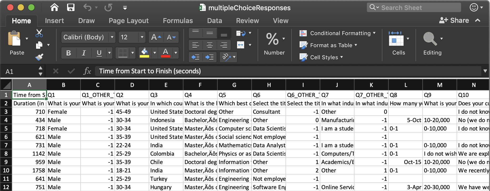
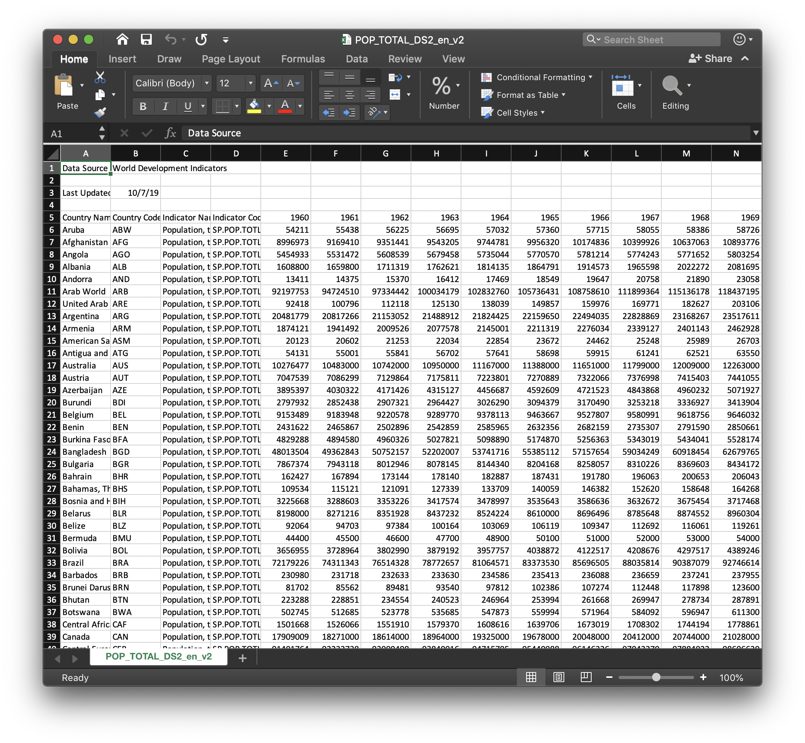
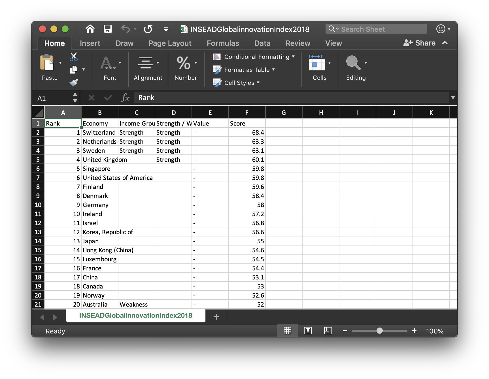

```{r load packages, echo = FALSE, warning = FALSE, message = FALSE}
#general data manipulation
library(dplyr) # data manipulation
library(readr) # input/output
library(data.table) # data manipulation
library(tibble) # data wrangling
library(tidyr) # data wrangling
library(stringr) # string manipulation
library(forcats) # factor manipulation

#specific data manipulation
library(purrr) # string manipulation

#general visualisations
library(ggplot2) # visualisation 

#specific visualisation
library(highcharter) # visualisation
library(countrycode) # visualisation

#knitting rmd output
library(knitr)
library(magrittr)
library(DT)
library(kableExtra)
```

class: inverse, center, middle

# Outline  

__[About our dataset](#about)__

__[Data preparation](#prep)__

__[Survey analysis](#results)__

_Survey analysis: [Geography](#geography)_

_Survey analysis: [Countries](#countries)_

__It's your turn!__

---

class: left
name: about

# Our Example Dataset  

__[Kaggle Machine Learning and Data Science Survey 2018](https://www.kaggle.com/kaggle/kaggle-survey-2018)__
- The industry-wide survey presents the state of data science and machine learning
- It was published in as raw a format as possible while ensuring the anonymity of respondents
- Our survey analysis includes some code snippets adapted from R Notebooks created by the Kaggle users [Heads or Tails](https://www.kaggle.com/headsortails/what-we-do-in-the-kernels-a-kaggle-survey-story) and [Jose Berengueres](https://www.kaggle.com/harriken/storytelling-the-2018-kaggle-survey)

--

__More about Kaggle__
- An online community for data science, owned by Google (>1 mil users in 2017)
- Users can:
  - Find and publish data sets
  - Explore and build models in a web-based environment
  - Work with others to enter machine learning competitions

---

class: left

# Our Example Dataset  

__[Kaggle Machine Learning and Data Science Survey 2018](https://www.kaggle.com/kaggle/kaggle-survey-2018)__
- Data comes in 3 files, located in the folder `~/data/kaggle-survey-2018`
  1. **Multiple choice responses**  

  2. **Free-form responses** to open-ended questions

  3. **Survey schema** shows an overview of responses  
  
**In this lesson, we will only be using the file containing the multiple choice responses.**

```{r eval = TRUE, echo = FALSE, out.width=1000, fig.align='center'}

```

???

- Note: 2 rows of headers

---

class: inverse, left, center, middle

# Before we begin...

__Install and load packages__

We will be using more packages from the [tidyverse](https://www.tidyverse.org), as well as other specialised packages

---

class: left
name: prep

# Load data

**Import tabular data as _tibbles_**
- [Tibbles](https://cran.r-project.org/web/packages/tibble/vignettes/tibble.html) are a modern take on dataframes. They...
  - Never change the input type (e.g. character strings will not be converted to factors)
  - Never adjust the names of variables (e.ge will not replace white space with `.`)
  - Never uses `row.names()`
  - Always return another tibble during subsetting operations  

--

```{r}
multi <- as_tibble(fread('../../data/kaggle-survey-2018/multipleChoiceResponses.csv', skip = 1))
```

_Notes:_  
`fread()` Speeds up reading of data into R  
`skip = 1` Skip the first line of the .csv file

---

class: left

# Examine data

__Use `colnames()` to examine column names__  
```{r echo = FALSE}
head(colnames(multi))
```

<br>

--

Because of the white spaces, we need to wrap the colname with backticks. For example:
```{r eval = FALSE}
multi$`Duration (in seconds)`
```
  - This is not very feasible/readable  
  - We'll abbreviate the colnames later on as we analyse each topic in the survey  

---

class: left

# Examine data

__Use `head()` or `str()` to examine data type/structure__

```{r echo = FALSE}
head(multi)
```

???

- Colnames are so long that you can't even read them properly

- What is your gender? - character vectors

---

class: left

# Convert data

__Convert columns of _character_ strings into _factors_ using `mutate_if()`__

```{r eval = FALSE}
multi <- multi %>%
  mutate_if(is_character, as_factor)
```

--

## More Info 🧐  
__The pipe operator `%>%`__  
- Used to manipulate data in stages
- Often used in the `tidyverse`
- Highly readable and follows a logical sequence
- For example:
```{r eval = FALSE}
round(exp(diff(log(x))), 1) #using nested brackets

x %>% log() %>% #using the pipe operator
    diff() %>%
    exp() %>%
    round(1)
```

---

class: left

# Convert data

__Convert columns of _character_ strings into _factors_ using `mutate_if()`__

```{r}
multi <- multi %>%
  mutate_if(is_character, as_factor)
```

- Overwrite existing variable `multi`

- Remember to access help about functions `?mutate_if` `?is_character` `?as_factor`
  - `mutate_if(.tbl, .predicate, .funs, ...)`

---

class: inverse, left, center, middle
name: results

# Survey Analysis

_`r nrow(multi) ` respondents_

???

- How do I get the no. of respondents? nrow()

---

class: left

# Survey duration

Let's do a little housekeeping...  
- Abbreviate the colname to `duration` using `rename()` 
- Change the units from seconds to minutes using `mutate()`
```{r}
multi <- multi %>%
  rename(duration = `Duration (in seconds)`) %>% #rename column
  mutate(duration = duration/60) #change to minutes (use new colname)

head(multi$duration) #see first few elements
```

---

class: left

# Survey duration

__Plot a histogram using the `ggplot2` package__

- A very popular package used for data visualisation
- It provides a systematic way to create graphics based on [The Grammar of Graphics](https://www.amazon.com/Grammar-Graphics-Statistics-Computing/dp/0387245448/ref=as_li_ss_tl?ie=UTF8&qid=1477928463&sr=8-1&keywords=the+grammar+of+graphics&linkCode=sl1&tag=ggplot2-20&linkId=f0130e557161b83fbe97ba0e9175c431) (see [cheatsheet](https://github.com/rstudio/cheatsheets/blob/master/data-visualization-2.1.pdf)).  

---

class: left

# Survey duration

__Plot a histogram using the `ggplot()` function__

Three basic steps:  
1. Provide _data_  
2. Assign your data _variables_ to _aesthetics_  
3. Assign the graphical _primitives_  

```{r fig.height=4, eval = FALSE}
multi %>% #provide data
  ggplot(aes(duration)) + #assign variable 'duration' to aes()
  
  geom_histogram(bins = 50, fill = "grey") +
  geom_vline(xintercept = median(multi$duration), linetype = 2) + #add line for median duration
  
  #customisation
  scale_x_log10(breaks = c(2, 5, 10, 20, 60, 720, 1440)) + #log() x-axis to address extreme values
  labs(x = "Duration (mins)", y = "Number of respondents") + #change axis labels
  ggtitle("Most respondents took 15-20 min to complete survey") #add figure title
```

---

class: left

# Survey duration

__Plot a histogram using the `ggplot()` function__

```{r echo = FALSE, fig.height=5, fig.width=10, dev='svg'}
multi %>% #provide data
  ggplot(aes(duration)) + #assign variable 'duration' to aes()
  geom_histogram(bins = 50, fill = "grey") + #graphical primitive
  
  #customisation
  scale_x_log10(breaks = c(2, 5, 10, 20, 60, 720, 1440)) + #log x-axis to address extreme values
  geom_vline(xintercept = median(multi$duration), linetype = 2) + #add line for median duration
  labs(x = "Duration (mins)", y = "Number of respondents") + #change axis labels
  ggtitle("Most respondents took 15-20 min to complete survey") #add figure title
```

_Note: The dashed line denotes the median survey duration. The x-axis has been transformed to a logarithmic scale._

---

class: inverse, left, center, middle
name: geography

# Survey Analysis: Geography

---

class: left

# Geographical distribution

__Create summary table with the count of respondents per country__

First, let's abbreviate the colname to `country`
```{r}
multi <- multi %>%
  rename(country = `In which country do you currently reside?`) #rename col
```

---

class: left

# Geographical distribution

__Create summary table with the count of respondents per country__

```{r echo = FALSE}
ctry_n <- multi %>%
  count(country) %>%
  filter(!(country %in% c("Other", "I do not wish to disclose my location"))) %>%
  mutate(iso3 = countrycode(country, origin = "country.name", destination = "iso3c")) 
```

```{r echo = FALSE}
ctry_n %>%
  DT::datatable(fillContainer = FALSE, 
                rownames = FALSE,
                options = list(pageLength = 8))
```

---

class: left

# Geographical distribution

__Create summary table with the count of respondents per country__

```{r eval = FALSE}
ctry_n <- multi %>%
  count(country) %>%
  filter(!(country %in% c("Other", "I do not wish to disclose my location"))) %>%
  mutate(iso3 = countrycode(country, origin = "country.name", destination = "iso3c")) 
```

- `count()` the number of of observations per `country`
- `filter()` to exclude (`!`) invalid country names (rows) specified `%in%` the vector
- `mutate()` table to add a new column `iso3`, where factor names in `country` are mapped to the country code using `countrycode()`
- We create a new variable `ctry_n`

---

class: left

# Geographical distribution

__Dealing with duplicates__

Before we proceed, let's check if there are any duplicated country codes

```{r}
length(unique(ctry_n$iso3)) == length(ctry_n$iso3)
```
--
```{r}
ctry_n[duplicated(ctry_n$iso3) | duplicated(ctry_n$iso3, fromLast=TRUE),]
```

<br>

Seems like there were two options for South Korea!

---

class: left

# Geographical distribution

__Dealing with duplicates__

Let's combine the two rows for South Korea and add up the number of respondents `n`.

```{r}
ctry_n <- ctry_n %>%
  group_by(iso3) %>%
  summarise(country = first(country), #get the first value for country name
            n = sum(n)) #sum up duplicates
```

--

Check again:

```{r}
length(unique(ctry_n$iso3)) == length(ctry_n$iso3)
```

---

class: left

# Geographical distribution

__Plot `ctry_n` as an interactive map using the package [highcharter](http://jkunst.com/highcharter)__

```{r fig.height=6, eval = FALSE}
highchart() %>%
  hc_add_series_map(worldgeojson, #map data to add
                    ctry_n, #our data
                    value = 'n', #colname of interest in ctry_n
                    joinBy = 'iso3') %>% #both datasets have this colname (country code)
  
  #customisation
  hc_title(text = 'Geographical distribution of survey respondents') %>%
  hc_colorAxis(minColor = "#edf8b1", maxColor = "#2c7fb8") %>%
  hc_tooltip(useHTML = TRUE, headerFormat = "", pointFormat = "{point.country}: {point.n} respondents")
```

- Map data `worldgeojson` comes from https://code.highcharts.com/mapdata/custom/world.js. 

---

class: left

# Geographical distribution

```{r fig.height=6, echo = FALSE}
highchart() %>%
  hc_add_series_map(worldgeojson, #map data to add
                    ctry_n, #our data
                    value = 'n', #colname of interest in ctry_n
                    joinBy = 'iso3') %>% #both datasets have this colname (country code)
  
  #customisation
  hc_title(text = 'Geographical distribution of survey respondents') %>%
  hc_colorAxis(minColor = "#edf8b1", maxColor = "#2c7fb8") %>%
  hc_tooltip(useHTML = TRUE, headerFormat = "", pointFormat = "{point.country}: {point.n} respondents")
```
---

class: inverse, left, center, middle
name: countries

# Survey Analysis: Countries

---

class: left

# Country Analysis

.left-column[ 
### Datasets
]

.right-column[ 
Country-level datasets to analyse alongside our survey:

__Total population count__ ([The World Bank](https://data.worldbank.org/indicator/SP.POP.TOTL))  
```{r warning = FALSE}
pops <- as_tibble(fread('../../data/POP_TOTAL_DS2_en_v2.csv', skip = 4, header = TRUE))

pops <- pops %>% 
  rename(country = "Country Name", population = "2018") %>% 
  select(country, population) %>% #we are only interested in these 2 columns 
  mutate(iso3 = countrycode(country, origin = "country.name", 
                            destination = "iso3c"))
```

```{r eval = TRUE, echo = FALSE, out.width=1000, fig.align='center'}

```
]
---

class: left

# Country Analysis

.left-column[ 
### Datasets
]

.right-column[ 
Country-level datasets to analyse alongside our survey:

__Total population count__ ([The World Bank](https://data.worldbank.org/indicator/SP.POP.TOTL)) 
```{r echo = FALSE}
pops %>%
  DT::datatable(fillContainer = FALSE, 
                rownames = FALSE,
                options = list(pageLength = 5))
```
]

---

class: left

# Country Analysis

.left-column[ 
### Datasets
]

.right-column[ 
Country-level datasets to analyse alongside our survey:

__Total population count__ ([The World Bank](https://data.worldbank.org/indicator/SP.POP.TOTL)) 

- Some country names could not be matched to a country code. Use `is.na()` to look for `NA` values
```{r}
pops[is.na(pops$iso3),]
```
]

???

- Dealing with NAs. Impt!

---

class: left

# Country Analysis

.left-column[ 
### Datasets
]

.right-column[ 
Country-level datasets to analyse alongside our survey:

__Total population count__ ([The World Bank](https://data.worldbank.org/indicator/SP.POP.TOTL)) 

- Remove `NA` values with logical operator
```{r}
pops <- pops[!is.na(pops$iso3),]
```
]
--
.right-column[ 
- Stricter alternative: use `complete.cases()`
```{r eval = FALSE}
pops <- pops[complete.cases(pops),] #only includes rows that are complete!
```
]

---

class: left

# Country Analysis

.left-column[ 
### Datasets
]

.right-column[ 
Country-level datasets to analyse alongside our survey:

__Global Innovation Index__ ([INSEAD](https://www.kaggle.com/harriken/insead-global-innovation-index/downloads/insead-global-innovation-index.zip/1))

```{r warning = FALSE}
innov <- as_tibble(fread('../../data/INSEADGlobalinnovationIndex2018.csv'))

innov <- innov %>% 
  rename(country = "Economy", index = "Score") %>% 
  select(country, index) %>%
  mutate(iso3 = countrycode(country, origin = "country.name", 
                            destination = "iso3c"))
```

```{r eval = TRUE, echo = FALSE, out.width=1000, fig.align='center'}

```
]

---

class: left

# Country Analysis

.left-column[ 
### Datasets
]

.right-column[ 
Country-level datasets to analyse alongside our survey:

__Global Innovation Index__ ([INSEAD](https://www.kaggle.com/harriken/insead-global-innovation-index/downloads/insead-global-innovation-index.zip/1))
```{r echo = FALSE}
innov %>%
  DT::datatable(fillContainer = FALSE, 
                rownames = FALSE,
                options = list(pageLength = 5))
```

]
---

class: left

# Country Analysis

.left-column[ 
### <span style="color:grey">Datasets</span>
### Join
]
.right-column[
We have 3 summary tables with _'countries'_ as data points (each row):  

1. `ctry_n` Number of survey respondents
2. `pops` Total population
3. `innov` Innovation index
]

---

class: left

# Country Analysis

.left-column[ 
### <span style="color:grey">Datasets</span>
### Join
]
.right-column[
__Combine these tables by country code__ (`iso3` column)  

- The tables may have different countries from each other
- Only keep the rows (countries) that are present in all 3 tables, using the function `inner_join()`
```{r}
ctry_data <- ctry_n %>% 
  inner_join(innov, by = "iso3") %>% 
  inner_join(pops, by = "iso3")
```
]
--
.right-column[
- Check out different ways to join tables with `?inner_join`! 
- For example: `left_join()`, `right_join()`, `full_join()`...
]

---

class: left

# Country Analysis

.left-column[ 
### <span style="color:grey">Datasets</span>
### Join
]
.right-column[
__Combine these tables by country code__ (`iso3` column)  
```{r echo = FALSE}
ctry_data %>%
  kable("html") %>%
  kable_styling(bootstrap_options = "striped", font_size = 10)
```
]
???
- The colname `country` are also common across the 3 tables.
- These duplicate variables are given a suffix in the new table.
- Since the naming of countries are not always similar, joining tables by country code `iso3` gives us a larger dataset 
---

class: left

# Country Analysis

.left-column[ 
### <span style="color:grey">Datasets</span>
### Join
]
.right-column[
__Remove `country.x` and `country.y`__  
```{r}
ctry_data <- subset(ctry_data, select = -c(country.x,country.y))
```
]

---

class: left

# Country Analysis

.left-column[ 
### <span style="color:grey">Datasets</span>
### Join
]
.right-column[
__Remove `country.x` and `country.y`__  
```{r echo = FALSE}
ctry_data %>%
  kable("html") %>%
  kable_styling(bootstrap_options = "striped", font_size = 10)
```
]


---

class: left

# Country Analysis

## Kaggle membership

- Calculate the no. of respondents as a proportion of the total population
- Possible proxy for interest/prevalence of data science in each country
- Save it in a new colname `respop10k`

```{r}
ctry_data$respop10k <- ctry_data$n / ctry_data$population * 10000 #respondents per 10k ppl
```
--
```{r echo = FALSE}
ctry_data %>%
  kable("html") %>%
  kable_styling(bootstrap_options = "striped", font_size = 10)
```

---

class: left

# Country Analysis

## Kaggle membership

- Let's visualise `respop10k` in a bar chart instead of in a world map
- But before that, we can specify some design (color) customisations in a new column we'll call `label`
```{r}
ctry_data$label <- c("normal")
ctry_data[ctry_data$iso3=="USA",]$label = c("benchmark") #take US as a benchmark
ctry_data[ctry_data$iso3=="SGP",]$label = c("highlight") #highlight Singapore
```
--
```{r}
#convert to factor with specified levels
ctry_data$label <- factor(ctry_data$label, 
                          levels = c("normal", 
                                     "benchmark", 
                                     "highlight"))
levels(ctry_data$label)
```
--
```{r}
cols <- c("grey50","black","red") #create vector of corresponding colors
```


---

class: left

# Country Analysis

## Kaggle membership

- Let's visualise `respop10k` in a bar chart instead of in a world map
- But before that, we can specify some design (color) customisations in a new column we'll call `label`
```{r echo = FALSE}
ctry_data %>%
  kable("html") %>%
  kable_styling(bootstrap_options = "striped", font_size = 10)
```
